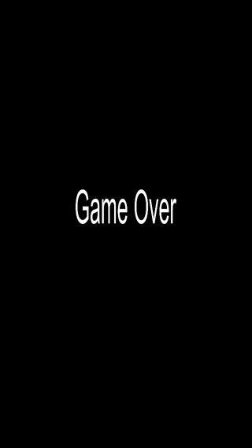

# The endless runner game prototype

This is a game prototype made to my blog post [Your first iOS game](https://medium.com/magnetis-backstage/your-first-ios-game-fda99504c3e4).

This is how the game looks like:

#

# Play

To test and play the game you need to clone the project:

```
git clone git@github.com:Lucasosf/the-fastest-square-alive.git
```

Open it with xcode:

```
cd the-fastest-square-alive ; open the-fastest-square-alive.xcodeproj
```

Then click in the play button.

# License

Feel free to use this project under the terms of the [MIT License](http://opensource.org/licenses/MIT)

Thank you.
